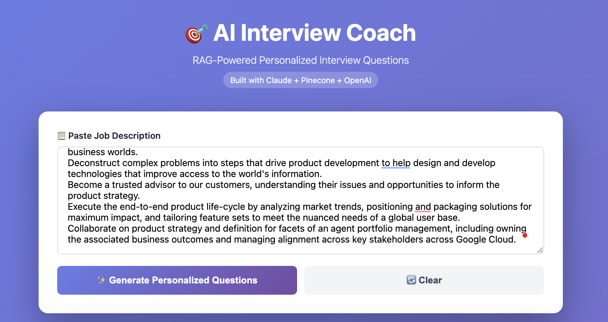
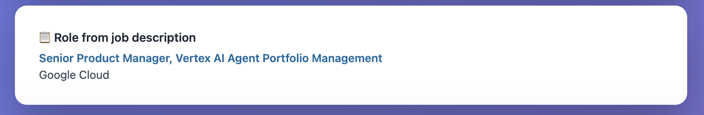
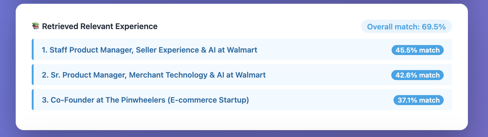
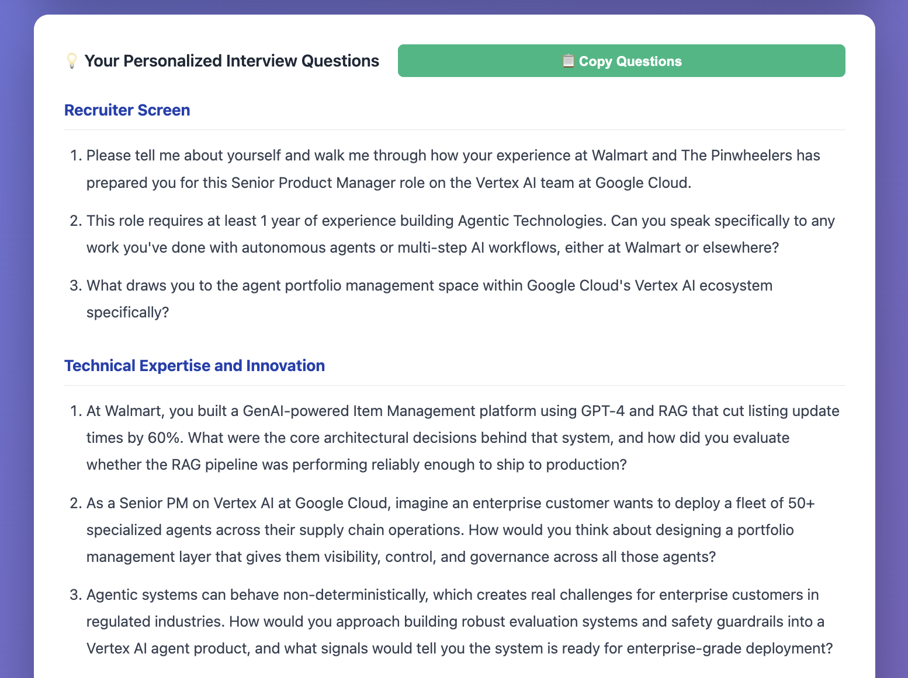
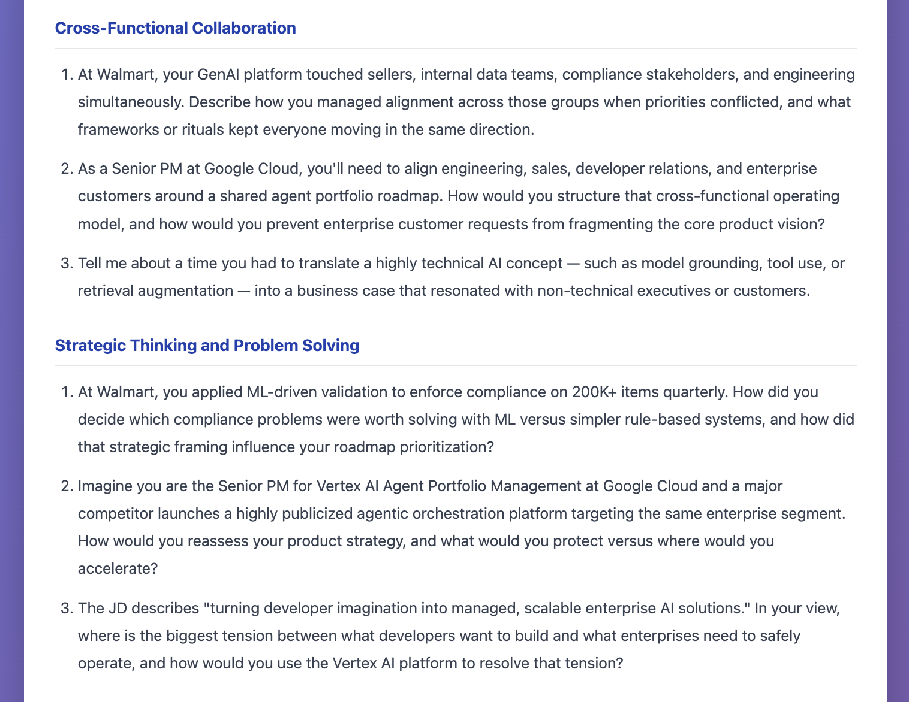
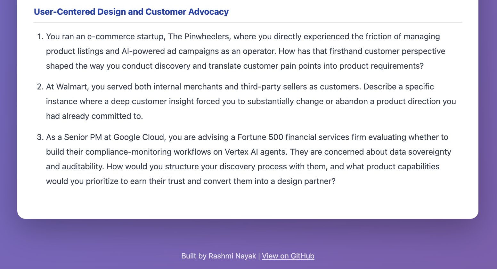

**🌐 Live Demo:** [interview-coach.springcolors.dev](https://interview-coach.springcolors.dev)

RAG-powered personalized interview preparation tool.
Built in 4 days as part of my 30-day AI building challenge.

**By:** [Rashmi Nayak](https://springcolors.dev) | springcolors 🌸
```

# Interview Prep AI

RAG-powered web app that generates **personalized behavioral interview questions** for product management roles using your resume and a job description.

---

## What it does

- **Paste a job description** → The app extracts the **job title** and **company** and shows them in a dedicated section.
- **RAG retrieval** → Your resume (embedded in Pinecone) is searched for the most relevant experience; results are **deduplicated by role/company** with an **aggregated match %** per experience.
- **Overall match** → A single **profile match percentage** (aligned with holistic “fit” scores from other tools) is shown.
- **5 tailored questions** → Claude generates **behavioral (STAR-style) questions** that tie the job requirements to your actual achievements.

---

## Tech stack

| Layer | Technology |
|-------|-------------|
| **Frontend** | Vanilla HTML/CSS/JS, no framework |
| **Backend** | Node.js, Express |
| **LLM** | Anthropic Claude (`claude-sonnet-4-6`) for question generation and job title/company extraction |
| **Embeddings** | OpenAI `text-embedding-3-small` (1536 dims, `encoding_format: float`) |
| **Vector DB** | Pinecone (index dimension **1536**) |
| **Data** | Resume chunks in `resume-data.json`, embedded via `embed-resume.js` |

---

## Setup

### 1. Clone and install

```bash
git clone https://github.com/springcolors/interview-prep-ai.git
cd interview-prep-ai
npm install
```

### 2. Environment variables

Create a `.env` file in the project root:

```env
ANTHROPIC_API_KEY=sk-ant-...
OPENAI_API_KEY=sk-...
PINECONE_API_KEY=...
PINECONE_INDEX=interview-prep
```

- **ANTHROPIC_API_KEY** – [Anthropic Console](https://console.anthropic.com) (for Claude).
- **OPENAI_API_KEY** – [OpenAI API keys](https://platform.openai.com/account/api-keys) (for embeddings).
- **PINECONE_API_KEY** & **PINECONE_INDEX** – [Pinecone](https://app.pinecone.io). Create an index with dimension **1536** (for `text-embedding-3-small`).

### 3. One-time: embed your resume

Resume data lives in `resume-data.json`. Embed it into Pinecone once (or after changing the resume):

```bash
node embed-resume.js
```

You should see a summary of chunks uploaded per experience.

### 4. Run the app

```bash
npm start
```

Open [http://localhost:3000](http://localhost:3000). Paste a job description and click **Generate Personalized Questions**.

---

## API

| Endpoint | Description |
|----------|-------------|
| `GET /` | Serves the web UI |
| `GET /api/health` | Returns whether required env vars are set (no API calls) |
| `POST /api/generate-questions` | Body: `{ "jobDescription": "..." }`. Returns `questions`, `jobTitle`, `company`, `overallMatch`, `relevantExperiences` |

---

## Project layout

| File / folder | Purpose |
|---------------|---------|
| `server.js` | Express server, `/api/generate-questions`, prompt and response parsing |
| `retrieval.js` | Pinecone + OpenAI retrieval; groups chunks by experience and aggregates scores |
| `embed-resume.js` | One-off script to embed `resume-data.json` into Pinecone |
| `resume-data.json` | Resume structured as experiences (role, company, achievements, etc.) |
| `test-retrieval.js` | Quick test for retrieval (run with `node test-retrieval.js`) |
| `index.html` | Single-page UI (paste JD, see role/company, match %, and questions) |

---

## Current status

**v1.0** – RAG pipeline with Pinecone + OpenAI embeddings; Claude for questions and JD extraction; role/company card; retrieved experience with aggregated match % and overall profile match; 5 behavioral questions with simple markdown-style formatting.

---

## Possible next steps

- Save questions by job/company
- Practice mode with follow-ups or self-scoring
- Product-sense or estimation question types
- Optional auth and per-user history

---

## Screenshots from the app

Flow: **input** → **role from JD** → **retrieved experience** → **personalized questions** (by section).

---

**1. Paste job description & generate**



*Paste a job description and click Generate Personalized Questions.*

---

**2. Role from job description**



*Job title and company extracted from the JD.*

---

**3. Retrieved relevant experience**



*Relevant experience from your background with per-role match and overall match %.*

---

**4. Recruiter screen & technical questions**



*Recruiter Screen and Technical Expertise and Innovation sections.*

---

**5. Cross-functional & strategy questions**



*Cross-Functional Collaboration and Strategic Thinking and Problem Solving.*

---

**6. User-centered design questions**



*User-Centered Design and Customer Advocacy section.*
